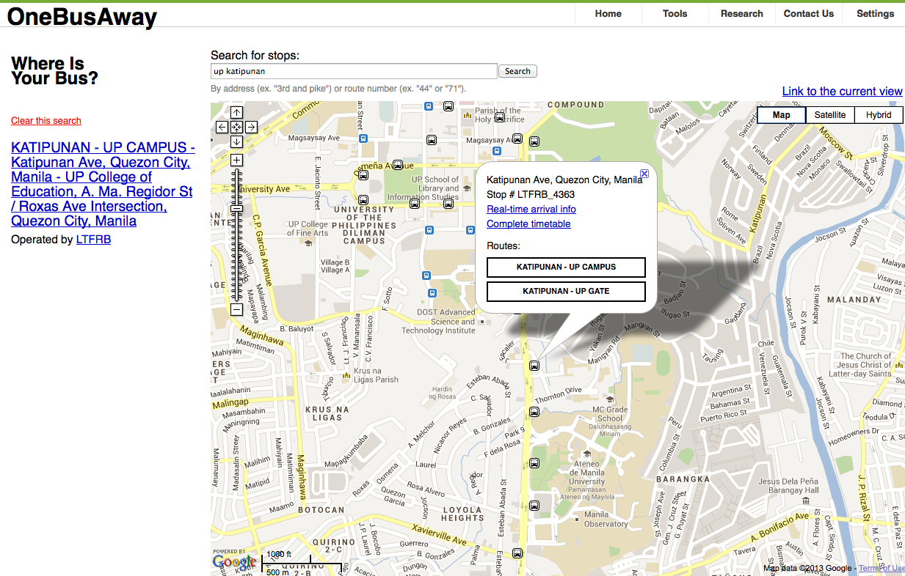

<!-- 
.. link: 
.. description: 
.. tags: philippine-transit-app, programming
.. date: 2013/07/09 01:53:59
.. title: One Bus (or maybe Jeep) Away
.. slug: one-bus-or-maybe-jeep-away
-->

Link: [http://onebusaway.org/](http://onebusaway.org/)

**TL;DR** no routing; useless in Philippines

OneBusAway is a transit information app. It provides data on what bus stops are near you, which buses pass by. You can also get schedules and the route of a particular bus given the number. It can also provide realtime updates like how many minutes until the next bus arrives. It does not, however, provide routing. There is no support for providing directions to get from point A to point B.

It's comparable to what you get in some bus stops abroad. You'd get a vicinity map and a list of buses passing through the stop. You might also get the times when the next buses will pass. It's useful for locals who already know how to get around, and want to avoid waiting for the bus. But it's not particularly good for people who want to know how to get around the city.

OneBusAway is quite comprehensive in its platform support though. There is a webapp, apps for iOS, Android and Windows Phone, as well as SMS and Voice support. This would all be nice but we don't have the necessary infrastructure yet in the Philippines. We don't have bus or jeepney stops. We also wouldn't have realtime data to make the app particularly useful.

You can try it out for yourself by following their [Quickstart Guide](https://github.com/OneBusAway/onebusaway-application-modules/wiki/OneBusAway-Quickstart-Guide). One caveat is you will have to add `-P tripEntriesFactory.throwExceptionOnInvalidStopToShapeMappingException=false` when building the bundle. This has to do with the OneBusAway having difficulty matching the [stops to the shape data](https://github.com/OneBusAway/onebusaway-application-modules/wiki/Stop-to-Shape-Matching).

Here's some screenshots of the app with the Philippine data. Notice how you only see the stops but there isn't a line for the route. This is a problem with our GTFS data. Also, at some points it's hard to tell where the jeep is going to pass since there isn't any indication of order either. This is more of a OneBusAway problem. It usually expects there to be shape data available.

It doesn't really handle too many routes passing through a stop. The list just overflows past the bubble. You can still actually read it by panning the map. It's just a bit weird though.

If you also noticed, there are usually 2 of each route. This is how the jeepney data was modeled as jeep routes might be different going one way and going back. This isn't the case for all jeeps though, so it might also be an implementation issue with the GTFS editor.

