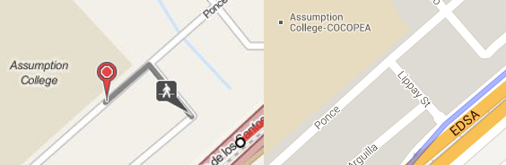
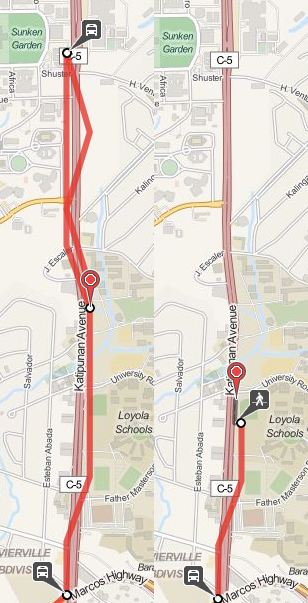
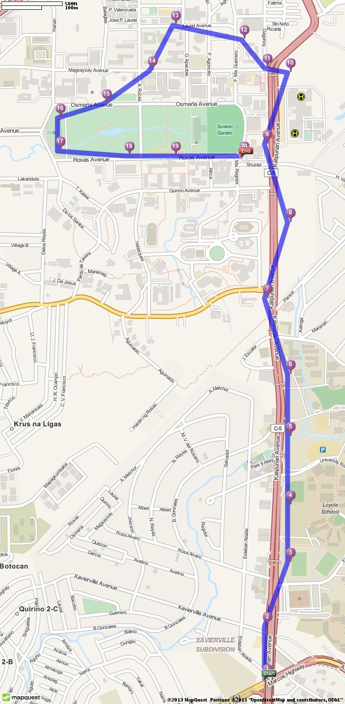

<!-- 
.. link: 
.. description: 
.. tags: philippine-transit-app, programming
.. date: 2013/07/09 23:16:12
.. title: Open Trip Planner
.. slug: open-trip-planner
-->

Link: [http://www.opentripplanner.org](http://www.opentripplanner.org)

**TL;DR** routes pretty well; data might cause weird issues

OpenTripPlanner, as the name implies, is a routing app. Given point A and point B, it can provide possible routes by taking transit, riding a bike, or a mix of both. You can also specify options on how much walking you're willing to do or if you prefer fewer transfers over trip time. It could be a good competitor to the transit directions of Google Maps.

It's actually in general use by the [Trimet](http://maps.trimet.org/), Portland's public transit system. I think a good reason why they deployed OpenTripPlanner is that Portland is a very bike friendly area. OpenTripPlanner's support for multi-modal (bike + transit) routing is one thing that even Google Maps doesn't have. This actually just screams [Inclusive Technology Award](http://philippine-transit.hackathome.com/prizes/).

### Setup

Getting OpenTripPlanner up and running involves a bit more downloading than OneBusAway. I'd suggest going through the [5-minute introduction](https://github.com/openplans/OpenTripPlanner/wiki/FiveMinutes) if you want to actually work with the Philippine data. You will also need to download the [Philippine data dump](http://download.geofabrik.de/asia/philippines.html) from OSM. You will want the `osm.bz2` one (WARNING: 900MB unzipped).

Once you get the webapp running, you'll notice the map tiles won't load correctly. This is because the default tileset used is from Mapbox which doesn't provide publicly free tilesets anymore. To actually see things on the map, you should click the + on the upper-right of the map and change the base layer to something like Open Street Map or OSM Mapquest. This has been fixed in their latest sources.

### Issues

The next thing you'll notice is that you can't search for a place. You can only just pick points on the map and route between those. I'm still not exactly sure if it's supposed to have it, since the Trimet one has it. But even then adding it by using the Google Maps or MapQuest APIs shouldn't be too difficult.

Another missing thing compared to the Trimet planner is being able to look at the routes akin to OneBusAway. And even then, Trimet's implementation isn't as good for exploring as OneBusAway is. Seeing the schedule or seeing which routes pass through a stop are left to an external site to do.

There have been some weird issues with the routing though. A common occurence is the steps are somewhat disconnected (see image below). The left half shows OpenTripPlanner, it shows that you get off at a "stop" in EDSA and you should magically teleport to Arguilla street and start walking. To be fair, Google Maps (right half) shows that there is a street from the "stop" to Arguilla.

I can't say this isn't a bug. After all, OpenTripPlanner couldn't have magically known there really was a street there. If it did, it wouldn't just teleport you to the corner. I'm more inclined to think though that this is a result of not having any shape data. As a result, OpenTripPlanner might try to assume the stop could mean places within a certain radius of where it was defined.

Another weird issue that pops up sometimes is where it tells you to ride a jeep past the stop you want and then after a while, get off and ride a jeep back to your stop. A more general issue is that sometimes it won't give you the best route because it thinks you have to loop around to get to where you want to be. I don't really know how common this issue pops up though. It's highly dependent on where you put the marker. If you just move the marker down a little bit, it actually does give the correct route.

Much like the earlier problem, I can't tell if this is a bug or it's a result of the bad data. Once again though, I think the issue is more of bad data. If you look at the plotted UP-Katipunan route, the stops aren't even on the road. This probably makes it more difficult for OpenTripPlanner to actually tell if the stop and road are connected.

From what they said during the launch, most of the route data was collected by getting a person to ride a jeep with a smartphone. That would explain why the coordinates aren't that exact. Even then, it would have been nice if they at least cleaned up the data by moving the stops to the road. They would have had to go over them to name the stops anyway.

### Conclusion

Overall though, I really like OpenTripPlanner. It handles most of the hard parts of the challenge. It provides a REST API for doing routing with the GTFS + OSM data. There's also a lot of potential for additional open source work. A lot can be done to improve the default webapp. Adding a default location searcher would greatly improve usability. Adding in the route viewing features of OneBusAway would also be nice. Alternatively, you could even write your own client that just interfaces with the API.